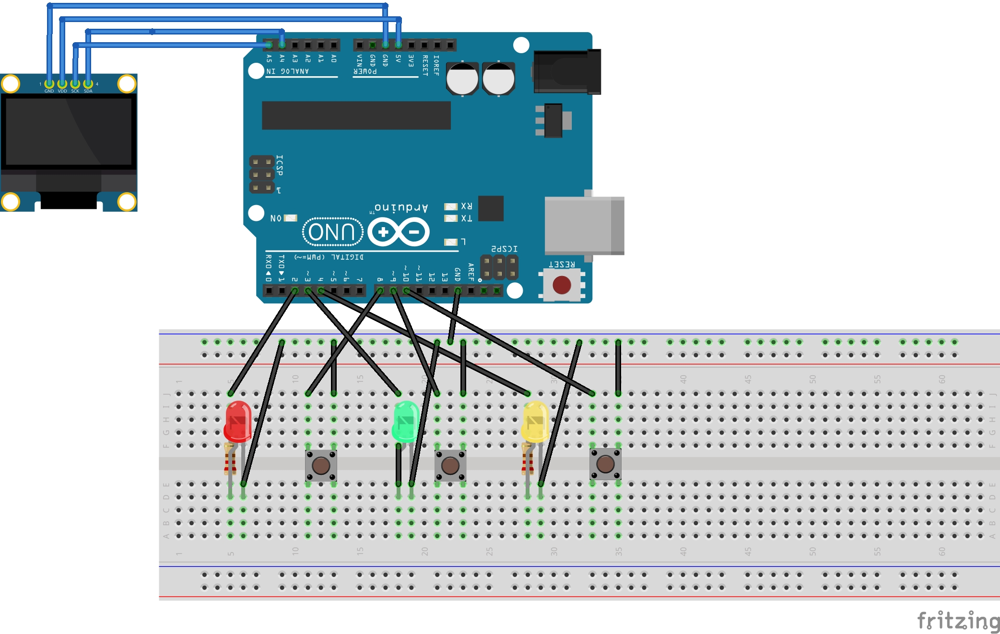

# Reaction-game-with-screen
Game with oled screen and hiscore.
In Arduino IDE, add libraries: (IDE → Tools → Manage Libraries)

Adafruit SSD1306

Adafruit GFX Library

Connect OLED SSD1306 I2C (4 pins)
OLED ->	Arduino Uno

VCC ->	5V

GND	-> GND

SDA	-> A4

SCL ->	A5

